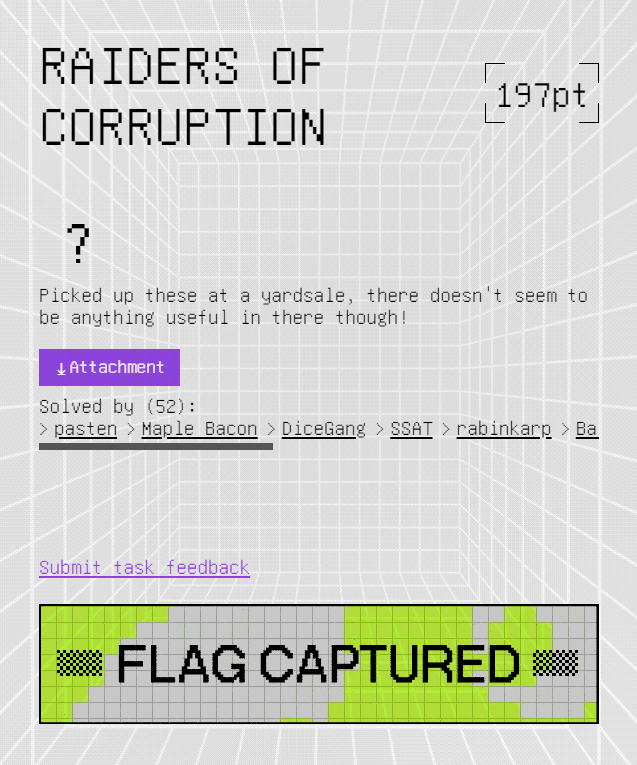

## lior@wildboar:/2021-google-ctf/raiders_of_corruption# cd ..

[Go Back](../index.md)

---------

# Raiders of Corruption [52 solves, 197pt]

## Challenge Description

> Picked up these at a yardsale, there doesn't seem to be anything useful in there though!
>
> [Attachment](./original.zip)

## Solution

### Preface: Analysis & Setting Up the Battle Scene

We begin by downloading the `.zip` file attached in the challenge's description and extracting the challenge files from it.

{TODO: ADD WGET AND EXTARCT COMMAND AND LS OUTPUT}

As we can see, the attached `zip` file contains 10 `.img` files. Let's analyze them.

{TODO: ADD FILE COMMAND OUTPUT}

